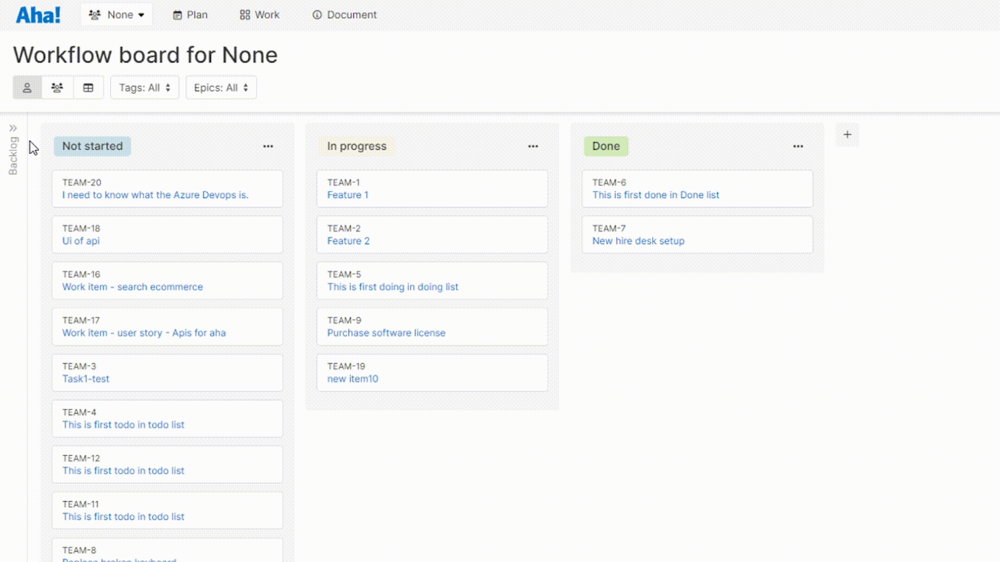

# Azure Devops Task Importer - Aha Extension
  
This [Aha! Develop](https://www.aha.io/develop/overview) extension allows you to bring Azure Devops Tasks into Aha!. It currently supports:

- Title (as String)
- Description (as HTML)

## Demo



## Installing the extension

**Note: In order to install an extension into your Aha! Develop account, you must be an account administrator.**

Install the Azure devops Importer extension by clicking [here](https://secure.aha.io/settings/account/extensions/install?url=).

## Working on the extension

Install [`aha-cli`](https://github.com/aha-app/aha-cli):

```sh
npm install -g aha-cli
```

Clone the repo:

TODO: Add the repository URL here
```sh
git clone https://github.com/fahimermo/azure-devops-importer
```

**Note: In order to install an extension into your Aha! Develop account, you must be an account administrator.**

Install the extension into Aha! and set up a watcher:

```sh
yarn install or npm install
aha extension:install
```

Now, any change you make inside your working copy will automatically take effect in your Aha! account.

## Building

When you have finished working on your extension, package it into a `.gz` file so that others can install it:

```sh
aha extension:build
```

After building, you can upload the `.gz` file to a publicly accessible URL, such as a GitHub release, so that others can install it using that URL.

To learn more about developing Aha! Develop extensions, including the API reference, the full documentation is located here: [Aha! Develop Extension API](https://www.aha.io/support/develop/extensions)
